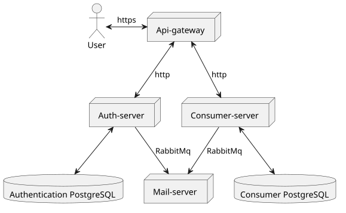

<h3>Все микросервисы были вынесены в отдельные репозитории для простоты настройки CI/CD:</h1>

<a href="https://github.com/dmitrykap1an/api">Api-gateway</a>  
<a href="https://github.com/dmitrykap1an/auth-server">Сервер аутентификации</a>  
<a href="https://github.com/dmitrykap1an/consumer-server">Клиентский сервер</a>  
<a href="https://github.com/dmitrykap1an/mail-server">Почтовый сервер</a>  

<h4>Инфраструктура</h4>
<a href="https://kaplaan.ru/swagger-ui.html">Документация к API</a>
 
<a href="https://grafana.kaplaan.ru">Grafana</a>
